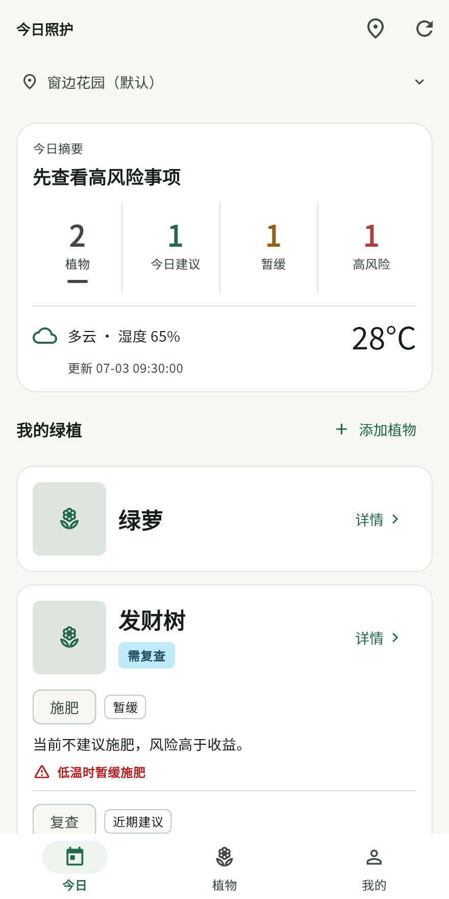
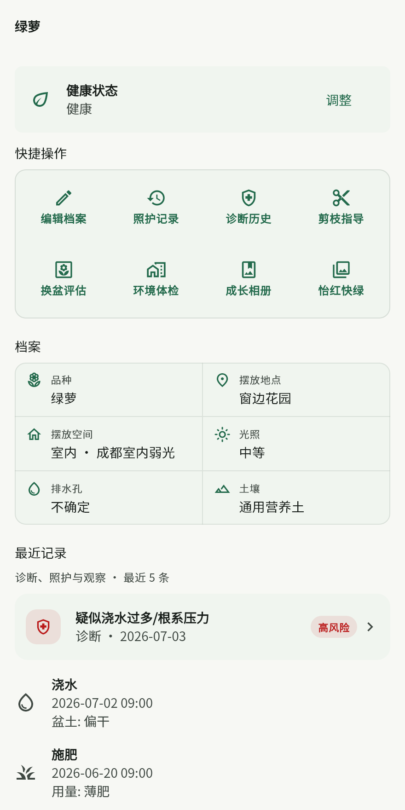
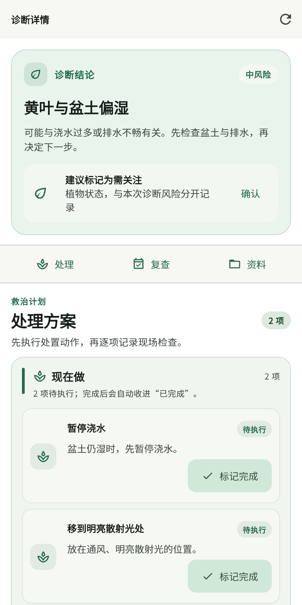
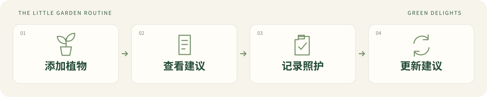

<div align="center">


# 怡红快绿

**GREEN DELIGHTS · 给每一盆绿意，多一点懂它的照顾**

把植物养在生活里，把照护记在手机里。<br />
从一盆绿萝开始，慢慢拥有自己的小小花园。

**[↓ 下载 Android 测试版](https://github.com/yaoyouzhong/green-delights-releases/releases/download/v0.3.2-rc.2/green-delights-v0.3.2-rc.2-10043-arm64.apk)**　·　[版本说明](https://github.com/yaoyouzhong/green-delights-releases/releases/tag/v0.3.2-rc.2)　·　[反馈问题](https://github.com/yaoyouzhong/green-delights-releases/issues)

`Android 7.0+`　`arm64-v8a`　`手机本地运行`　`v0.3.2-rc.2`

</div>

> [!NOTE]
> 这是公开测试版，已在一台 Android 真机完成覆盖升级、启动和首页显示检查；完整业务主流程与其他机型仍需验证。安装前请导出备份，优先在测试设备使用。本仓库提供说明和安装包，应用源码保持私有。

## 🎬 48 秒了解怡红快绿

https://github.com/user-attachments/assets/ed22c060-304f-488a-8452-3932e1344db6

点击上方播放器即可在本页观看，建议打开声音。48 秒 · 原生界面演示 · 配乐与音效

[下载 1080p 原片](https://github.com/yaoyouzhong/green-delights-releases/releases/download/v0.3.2-rc.2/green-delights-promo.mp4)

从今日照护、诊断与复查，到植物档案和本地备份，看看日常照护如何串起来。界面使用固定演示数据。

## 这次更新：少一点打扰，多一点清楚

- **首页更清楚：** 摘要和天气放在一起，统计按颜色区分，天气去掉重复标题，左侧天气与湿度、右侧突出温度，更新时间独立一行，地点栏与底栏更轻。
- **浇水按需参考：** 默认关闭普通浇水提醒；关闭“浇水参考”后，首页也会隐藏对应内容。高风险和暂缓照护提示保留。
- **复查按需展开：** 首页诊断复查说明默认折叠，点击“查看复查详情”再读完整内容。

<p align="center">



</p>

截图由当前 App 页面渲染，使用固定演示数据，不包含个人照片或地点。

## 🌿 今天，这盆植物需要什么？

昨天刚浇过水，今天叶子还是有点蔫；窗边阳光很好，它却开始黄叶；花盆摆了很久，究竟该不该换？

怡红快绿把植物品种、摆放环境、天气和照护记录放在一起，给你一个更具体的下一步：**检查盆土、适量照护、暂缓施肥，或者先观察。** 你记录一次真实操作，下一次建议也会随之调整。



## 🪴 从照顾一盆，到打理一整个小花园

| 看懂它的需要 | 留住它的变化 |
| :--- | :--- |
| **💧 今日照护**<br />先看今日结论，再按颜色区分建议、暂缓与风险。浇水参考默认关闭，需要时再开启。 | **📷 成长相册**<br />保存成长照片和备注，在照片墙里回看一片新叶、一朵小花。 |
| **🩺 诊断与复查**<br />用照片和症状辅助判断，记录救治行动，复查时比较前后变化。需自配视觉大模型。 | **📝 照护日记**<br />浇水、修剪、换盆、移动位置都留下记录，想回顾时有迹可循。 |
| **🌤️ 摆放与换盆**<br />通过环境体检和根系评估，检查光照、通风、排水以及换盆条件。 | **🏡 多地点管理**<br />家里的阳台、办公室的窗台，分开管理，按地点逐盆确认照护。 |

### 一盆绿植的日常，可以很轻松

**早上，先看一眼。** 打开今日照护，先看摘要与天气，再看看哪些植物值得留意。浇水前摸一摸盆土、看看植物，再决定是否需要。

**照顾过，就记下来。** 实际浇水、施肥或调整位置后再记录，让之后的建议有依据。不需要为了清空提醒而每天打卡。

**有变化，拍张照片。** 新芽值得记录，黄叶也值得观察。需要帮助时，可用自己配置的视觉大模型辅助诊断，再按计划复查。

## 📲 把小花园装进口袋

| 当前安装包 | |
| :--- | :--- |
| **版本** | `v0.3.2-rc.2` · 公开测试版 |
| **适用设备** | Android 7.0 及以上，arm64-v8a |
| **大小 / 构建号** | 约 22.5 MiB / `10043` |
| **安装包** | [下载 APK](https://github.com/yaoyouzhong/green-delights-releases/releases/download/v0.3.2-rc.2/green-delights-v0.3.2-rc.2-10043-arm64.apk) |
| **下载校验** | [SHA-256 清单](https://github.com/yaoyouzhong/green-delights-releases/releases/download/v0.3.2-rc.2/SHA256SUMS.txt) |

**第一次安装：** 下载 APK，在手机上打开，按 Android 提示允许该文件来源安装。GitHub 自动生成的 “Source code” 压缩包只有分发材料，不是安装包。

**从旧版升级：** 先在“备份恢复”中导出备份，并保存到手机之外。保留旧 App，直接覆盖安装；不要先卸载。本包与旧版使用同一签名，构建号为 `10043`，如果你已安装更高构建号，请保留现有版本。

<details>
<summary><strong>如何核对下载文件？</strong></summary>

下载 APK 和 `SHA256SUMS.txt`。在 Windows PowerShell 中运行下面的命令，将输出的 SHA-256 与清单中的 APK 项比较：

```powershell
Get-FileHash -Algorithm SHA256 .\green-delights-v0.3.2-rc.2-10043-arm64.apk
```

</details>

## 🌱 五分钟，认识你的第一盆植物

1. **安一个家。** 在“手机本地”模式下新建地点，填写城市与摆放环境，不需要启动电脑后端。
2. **添一盆绿意。** 添加植物，完善品种、盆土、光照和实际养护情况。
3. **看懂今日建议。** 先检查实际状态，照护完成后再记录。
4. **按需开启联网能力。** 在“运行状态”填写自己的天气和大模型配置，使用天气、识别、诊断与剪枝指导。
5. **留一份安心。** 导出备份；需要照护提醒时开启通知权限，并测试通知是否正常。

<details>
<summary><strong>天气和大模型，需要配置什么？</strong></summary>

| 能力 | 配置 |
| :--- | :--- |
| QWeather | API Host、项目 ID、凭据 ID、私钥 |
| 视觉大模型 | 支持图片输入的 OpenAI-compatible base URL、model、API key |

建议使用服务商提供的 HTTPS 接口。凭据由你自行申请和保管，服务可用性、额度和费用由相应服务商决定。App 不内置开发者凭据，也不要求把凭据发给项目维护者。

QWeather 不可用时，App 会尝试 Open-Meteo 备用天气服务。没有网络时天气无法刷新；植物档案、照护记录和本地建议可以在手机上使用。不同手机的省电设置可能影响通知。

</details>

## 🔐 花园在手机里，数据也有去处

植物、照片和照护记录保存在手机本地；天气与模型凭据通过系统安全存储保存。App 导出的备份不包含这些凭据，换机后需要重新配置。

使用天气、识别或诊断时，相应的坐标、照片和上下文会发送给外部服务。备份 ZIP 包含个人数据，请妥善保管。导入采用追加模式，遇到同 ID 数据会阻断，不会静默覆盖。

[了解数据与联网范围 →](DATA.md)　[查看第三方软件声明 →](THIRD_PARTY_NOTICES.md)

## 🍃 一起把它养得更好

当前没有 iOS 版、云同步或多人共享。照片诊断只能辅助判断，不能替代对盆土、根系和环境的观察。长期通知、相册兼容性和大量照片性能仍需实际使用验证。

遇到问题，欢迎[提交反馈](https://github.com/yaoyouzhong/green-delights-releases/issues)。请附上手机型号、Android 版本、App 构建号与复现步骤，**不要上传 API key、私钥或完整备份**。

---

<div align="center">

**养植物，也给生活留一点慢慢生长的空间。**

<sub>封面为原创 AI 植物插画，流程图为概念示意，均非 App 截图。</sub>

</div>
